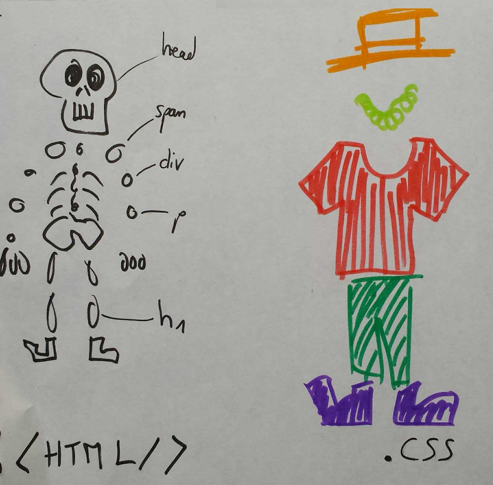

# weblings

## webling 0

### code

- html = le squelette
- css = la garde robe

### partage

## webling 1

- rajoute un carre vert
- tranforme le en rectangle
- rajoute rectangle bleu
- rajoute carre jaune entre les 2 rectangles
- rajoute un rond rouge et un rond jaune
